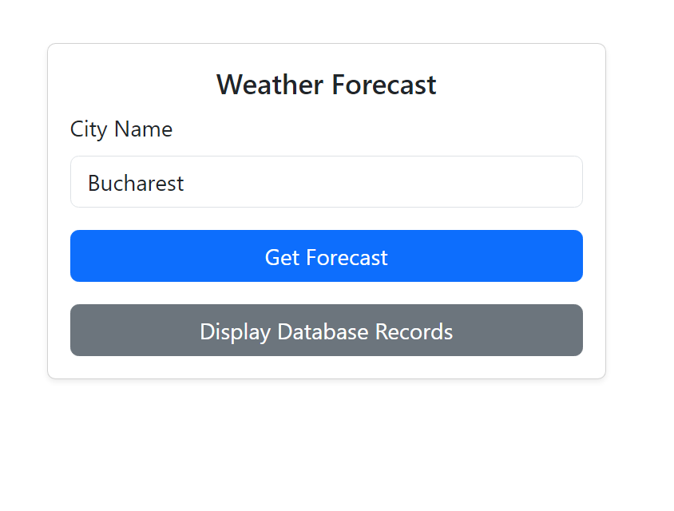
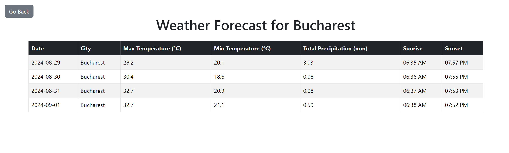
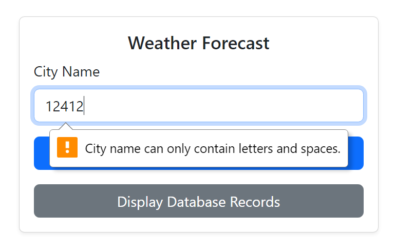
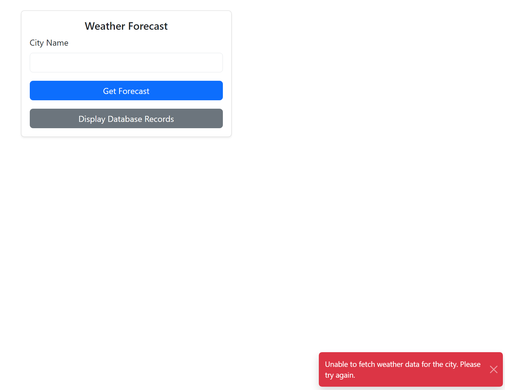
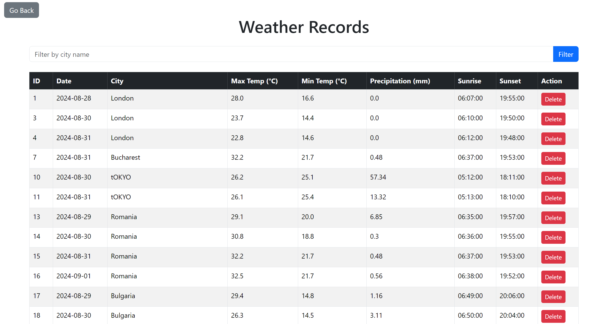
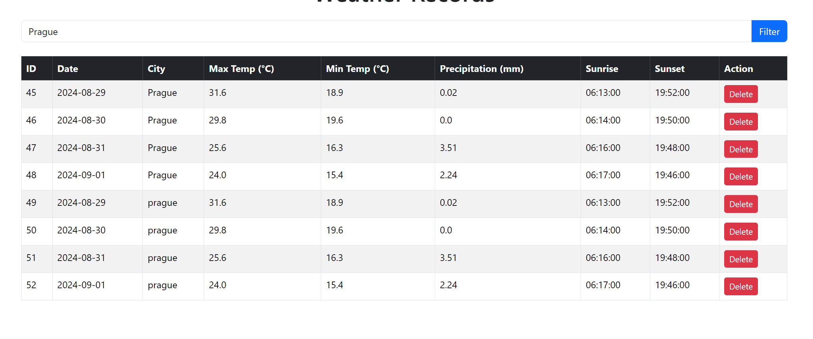
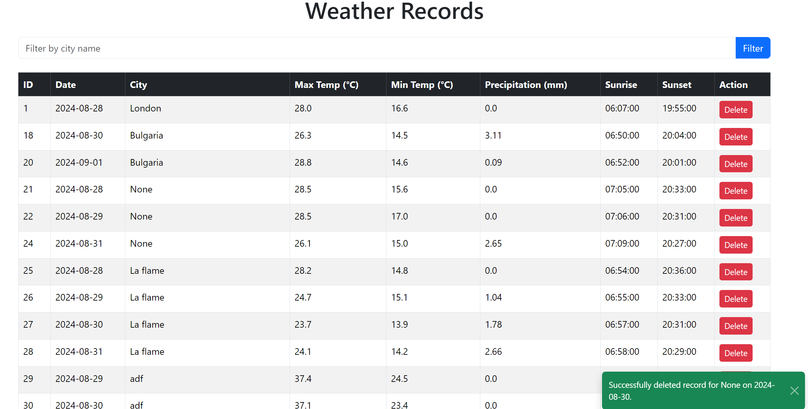

# Weather Forecast Application

This is a web application built with Flask that provides weather forecasts and allows users to view, filter, and delete stored weather records from a SQLite database. The application fetches weather data using the WeatherAPI and stores it in a local SQLite database.

## Features

- **Weather Forecast**: Users can enter a city name to fetch and display a 4-day weather forecast.
- **Database Records**: Users can view all stored weather records, filter them by city name, and delete individual records.
- **Custom Validation**: The application includes custom input validation for city names.
- **Responsive Design**: The user interface is built with Bootstrap for a clean and responsive design.

## Project Structure

- **app.py**: The main Flask application file that contains the route definitions.
- **models.py**: Defines the `Weather` model using SQLAlchemy.
- **weather_api.py**: Contains the function to fetch weather data from WeatherAPI.
- **templates/**: Contains the HTML templates for the application.
  - `weather_input.html`: The homepage where users can enter a city name to get a weather forecast.
  - `weather_table.html`: Displays the weather forecast for the specified city.
  - `weather_records.html`: Shows all stored weather records with options to filter and delete records.
- **static/**: Contains static files like CSS and JavaScript.

## Usage

### Fetching Weather Forecast

1. Navigate to the homepage (`http://127.0.0.1:5000/`).
2. Enter a city name in the input field and click "Get Forecast".
3. The application will display a 4-day weather forecast for the specified city.

### Viewing and Managing Records

1. Click on "Display Database Records" to view all stored weather records.
2. Use the filter input to search for records by city name.
3. Click "Delete" next to any record to remove it from the database. A toast notification will confirm the deletion.

### Input Validation

- The city name input field only accepts alphabetic characters and spaces.
- The city name cannot be empty, contain only spaces, or exceed 50 characters.

